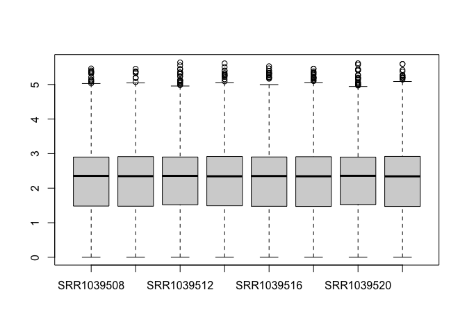
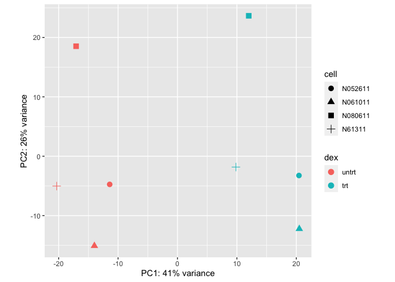
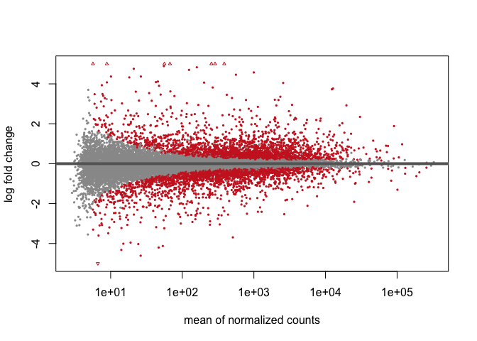
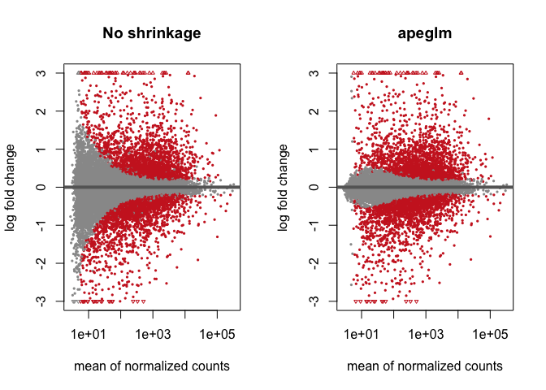
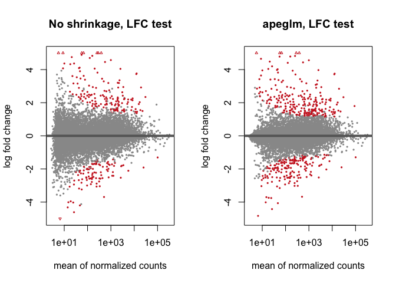

<br>

### Notes
This project uses the 'airway' package that summarizes an RNA-seq experiment wherein airway smooth muscle cells were treated with dexamethasone, a synthetic glucocorticoid steroid with anti-inflammatory effects (Himes et al. 2014). Glucocorticoids are used, for example, by people with asthma to reduce inflammation of the airways. In the experiment, four primary human airway smooth muscle cell lines were treated with 1 micromolar dexamethasone for 18 hours. For each of the four cell lines, we have a treated and an untreated sample.

<br>

#### Load libraries

```r
library(tidyverse)
library(airway)
library(DESeq2)
library(ggplot2)
library(apeglm)
library(AnnotationHub)
library(ReportingTools)
library(EnrichmentBrowser)
```

<br>

#### RStudio Session Information

```r
sessionInfo()
```

```
## R version 4.0.2 (2020-06-22)
## Platform: x86_64-apple-darwin17.0 (64-bit)
## Running under: macOS Catalina 10.15.5
## 
## Matrix products: default
## BLAS:   /Library/Frameworks/R.framework/Versions/4.0/Resources/lib/libRblas.dylib
## LAPACK: /Library/Frameworks/R.framework/Versions/4.0/Resources/lib/libRlapack.dylib
## 
## locale:
## [1] en_US.UTF-8/en_US.UTF-8/en_US.UTF-8/C/en_US.UTF-8/en_US.UTF-8
## 
## attached base packages:
## [1] parallel  stats4    stats     graphics  grDevices utils     datasets 
## [8] methods   base     
## 
## other attached packages:
##  [1] EnrichmentBrowser_2.18.2    graph_1.66.0               
##  [3] ReportingTools_2.28.0       knitr_1.30                 
##  [5] AnnotationHub_2.20.2        BiocFileCache_1.12.1       
##  [7] dbplyr_1.4.4                apeglm_1.10.0              
##  [9] DESeq2_1.28.1               airway_1.8.0               
## [11] SummarizedExperiment_1.18.2 DelayedArray_0.14.1        
## [13] matrixStats_0.57.0          Biobase_2.48.0             
## [15] GenomicRanges_1.40.0        GenomeInfoDb_1.24.2        
## [17] IRanges_2.22.2              S4Vectors_0.26.1           
## [19] BiocGenerics_0.34.0         forcats_0.5.0              
## [21] stringr_1.4.0               dplyr_1.0.2                
## [23] purrr_0.3.4                 readr_1.4.0                
## [25] tidyr_1.1.2                 tibble_3.0.3               
## [27] ggplot2_3.3.2               tidyverse_1.3.0            
## 
## loaded via a namespace (and not attached):
##   [1] readxl_1.3.1                  backports_1.1.10             
##   [3] GOstats_2.54.0                Hmisc_4.4-1                  
##   [5] plyr_1.8.6                    lazyeval_0.2.2               
##   [7] GSEABase_1.50.1               splines_4.0.2                
##   [9] BiocParallel_1.22.0           digest_0.6.25                
##  [11] ensembldb_2.12.1              htmltools_0.5.0              
##  [13] GO.db_3.11.4                  fansi_0.4.1                  
##  [15] checkmate_2.0.0               magrittr_1.5                 
##  [17] memoise_1.1.0                 BSgenome_1.56.0              
##  [19] cluster_2.1.0                 limma_3.44.3                 
##  [21] Biostrings_2.56.0             annotate_1.66.0              
##  [23] modelr_0.1.8                  R.utils_2.10.1               
##  [25] ggbio_1.36.0                  askpass_1.1                  
##  [27] bdsmatrix_1.3-4               prettyunits_1.1.1            
##  [29] jpeg_0.1-8.1                  colorspace_1.4-1             
##  [31] blob_1.2.1                    rvest_0.3.6                  
##  [33] rappdirs_0.3.1                haven_2.3.1                  
##  [35] xfun_0.18                     crayon_1.3.4                 
##  [37] RCurl_1.98-1.2                jsonlite_1.7.1               
##  [39] genefilter_1.70.0             VariantAnnotation_1.34.0     
##  [41] survival_3.2-7                glue_1.4.2                   
##  [43] gtable_0.3.0                  zlibbioc_1.34.0              
##  [45] XVector_0.28.0                Rgraphviz_2.32.0             
##  [47] scales_1.1.1                  mvtnorm_1.1-1                
##  [49] DBI_1.1.0                     GGally_2.0.0                 
##  [51] edgeR_3.30.3                  Rcpp_1.0.5                   
##  [53] progress_1.2.2                htmlTable_2.1.0              
##  [55] xtable_1.8-4                  emdbook_1.3.12               
##  [57] foreign_0.8-80                bit_4.0.4                    
##  [59] OrganismDbi_1.30.0            Formula_1.2-3                
##  [61] AnnotationForge_1.30.1        htmlwidgets_1.5.2            
##  [63] httr_1.4.2                    RColorBrewer_1.1-2           
##  [65] ellipsis_0.3.1                R.methodsS3_1.8.1            
##  [67] pkgconfig_2.0.3               reshape_0.8.8                
##  [69] XML_3.99-0.5                  nnet_7.3-14                  
##  [71] locfit_1.5-9.4                tidyselect_1.1.0             
##  [73] rlang_0.4.7                   reshape2_1.4.4               
##  [75] later_1.1.0.1                 AnnotationDbi_1.50.3         
##  [77] munsell_0.5.0                 BiocVersion_3.11.1           
##  [79] cellranger_1.1.0              tools_4.0.2                  
##  [81] cli_2.0.2                     generics_0.0.2               
##  [83] RSQLite_2.2.1                 broom_0.7.1                  
##  [85] evaluate_0.14                 fastmap_1.0.1                
##  [87] yaml_2.2.1                    bit64_4.0.5                  
##  [89] fs_1.5.0                      AnnotationFilter_1.12.0      
##  [91] RBGL_1.64.0                   mime_0.9                     
##  [93] R.oo_1.24.0                   KEGGgraph_1.48.0             
##  [95] xml2_1.3.2                    biomaRt_2.44.1               
##  [97] compiler_4.0.2                rstudioapi_0.11              
##  [99] curl_4.3                      png_0.1-7                    
## [101] interactiveDisplayBase_1.26.3 reprex_0.3.0                 
## [103] PFAM.db_3.11.4                geneplotter_1.66.0           
## [105] stringi_1.5.3                 GenomicFeatures_1.40.1       
## [107] lattice_0.20-41               ProtGenerics_1.20.0          
## [109] Matrix_1.2-18                 vctrs_0.3.4                  
## [111] pillar_1.4.6                  lifecycle_0.2.0              
## [113] BiocManager_1.30.10           data.table_1.13.0            
## [115] bitops_1.0-6                  rtracklayer_1.48.0           
## [117] httpuv_1.5.4                  hwriter_1.3.2                
## [119] R6_2.4.1                      latticeExtra_0.6-29          
## [121] promises_1.1.1                gridExtra_2.3                
## [123] dichromat_2.0-0               MASS_7.3-53                  
## [125] assertthat_0.2.1              openssl_1.4.3                
## [127] Category_2.54.0               withr_2.3.0                  
## [129] GenomicAlignments_1.24.0      Rsamtools_2.4.0              
## [131] GenomeInfoDbData_1.2.3        hms_0.5.3                    
## [133] grid_4.0.2                    rpart_4.1-15                 
## [135] coda_0.19-4                   rmarkdown_2.4                
## [137] biovizBase_1.36.0             bbmle_1.0.23.1               
## [139] numDeriv_2016.8-1.1           shiny_1.5.0                  
## [141] lubridate_1.7.9               base64enc_0.1-3
```


#### Load the airway data

```r
data("airway")
airway
```

```
## class: RangedSummarizedExperiment 
## dim: 64102 8 
## metadata(1): ''
## assays(1): counts
## rownames(64102): ENSG00000000003 ENSG00000000005 ... LRG_98 LRG_99
## rowData names(0):
## colnames(8): SRR1039508 SRR1039509 ... SRR1039520 SRR1039521
## colData names(9): SampleName cell ... Sample BioSample
```
The RangedSummarizedExperiment class is a matrix-like container where rows represent ranges of interest (as a GRanges or GRangesList object) and columns represent samples (with sample data summarized as a DataFrame). A RangedSummarizedExperiment contains one or more assays, each represented by a matrix-like object of numeric or other mode.
RangedSummarizedExperiment is a subclass of SummarizedExperiment and, as such, all the methods documented in ?SummarizedExperiment also work on a RangedSummarizedExperiment object. The methods documented below are additional methods that are specific to RangedSummarizedExperiment objects.


<br>

#### Specify that 'untrt' is the reference level for the dex variable

```r
airway$dex <- relevel(airway$dex, "untrt")
levels(airway$dex)
```

```
## [1] "untrt" "trt"
```

<br>


```r
head(assay(airway))
```

```
##                 SRR1039508 SRR1039509 SRR1039512 SRR1039513 SRR1039516
## ENSG00000000003        679        448        873        408       1138
## ENSG00000000005          0          0          0          0          0
## ENSG00000000419        467        515        621        365        587
## ENSG00000000457        260        211        263        164        245
## ENSG00000000460         60         55         40         35         78
## ENSG00000000938          0          0          2          0          1
##                 SRR1039517 SRR1039520 SRR1039521
## ENSG00000000003       1047        770        572
## ENSG00000000005          0          0          0
## ENSG00000000419        799        417        508
## ENSG00000000457        331        233        229
## ENSG00000000460         63         76         60
## ENSG00000000938          0          0          0
```


<br>

#### Check the millions of fragments that uniquely aligned to the genes

```r
round(colSums(assay(airway))/1e6, 1)
```

```
## SRR1039508 SRR1039509 SRR1039512 SRR1039513 SRR1039516 SRR1039517 SRR1039520 
##       20.6       18.8       25.3       15.2       24.4       30.8       19.1 
## SRR1039521 
##       21.2
```

<br>

#### Inspect the information about the samples

```r
table(airway$dex)
```

```
## 
## untrt   trt 
##     4     4
```

```r
colData(airway)
```

```
## DataFrame with 8 rows and 9 columns
##            SampleName     cell      dex    albut        Run avgLength
##              <factor> <factor> <factor> <factor>   <factor> <integer>
## SRR1039508 GSM1275862  N61311     untrt    untrt SRR1039508       126
## SRR1039509 GSM1275863  N61311     trt      untrt SRR1039509       126
## SRR1039512 GSM1275866  N052611    untrt    untrt SRR1039512       126
## SRR1039513 GSM1275867  N052611    trt      untrt SRR1039513        87
## SRR1039516 GSM1275870  N080611    untrt    untrt SRR1039516       120
## SRR1039517 GSM1275871  N080611    trt      untrt SRR1039517       126
## SRR1039520 GSM1275874  N061011    untrt    untrt SRR1039520       101
## SRR1039521 GSM1275875  N061011    trt      untrt SRR1039521        98
##            Experiment    Sample    BioSample
##              <factor>  <factor>     <factor>
## SRR1039508  SRX384345 SRS508568 SAMN02422669
## SRR1039509  SRX384346 SRS508567 SAMN02422675
## SRR1039512  SRX384349 SRS508571 SAMN02422678
## SRR1039513  SRX384350 SRS508572 SAMN02422670
## SRR1039516  SRX384353 SRS508575 SAMN02422682
## SRR1039517  SRX384354 SRS508576 SAMN02422673
## SRR1039520  SRX384357 SRS508579 SAMN02422683
## SRR1039521  SRX384358 SRS508580 SAMN02422677
```

<br>

#### Prepare data for differential expression analysis using DESeq2

```r
dds <- DESeqDataSet(airway, design = ~ cell + dex) # controlling for cell lines while testing for differences due to treatment
```
DESeqDataSet is a subclass of RangedSummarizedExperiment, used to store the input values, intermediate calculations and results of an analysis of differential expression. The DESeqDataSet class enforces non-negative integer values in the "counts" matrix stored as the first element in the assay list. In addition, a formula which specifies the design of the experiment must be provided. The constructor functions create a DESeqDataSet object from various types of input: a RangedSummarizedExperiment, a matrix, count files generated by the python package HTSeq, or a list from the tximport function in the tximport package. 

<br>

#### Minimal filtering to reduce the size of the dataset

```r
keep <- rowSums(counts(dds) >= 5) >= 4
table(keep)
```

```
## keep
## FALSE  TRUE 
## 46070 18032
```

```r
dds <- dds[keep,]
```
We do not need to retain genes if they do not have a count of 5 or more for 4 or more samples as these genes will have no statistical power to detect differences, and no information to compute distances between samples.

<br>

#### Basic Exploratory Analysis

```r
boxplot(log10(counts(dds)+1))
```

<!-- -->

<br>

#### Compute size factors to normalize counts for variation in sequencing depth among samples
The main function of DESeq2 includes calculation of size factors, but we are calculating these manually, so that the normalized counts are available for plotting.

```r
dds <- estimateSizeFactors(dds)
boxplot(log10(counts(dds,normalized=TRUE)+1))
```

<!-- -->
Taking the logarithm of counts plus a pseudocount of 1 is a common transformation, but it tends to inflate the sampling variance of low counts such that it is even larger than biological variation across groups of samples. DESeq2 therefore provides transformations which produce log-scale data such that the systematic trends have been removed. Recommended transformation is the variance-stabilizing transformation, or VST, and it can be called with the vst function.

<br>

#### Perform Variant Stabilizing Transformation (VST)

```r
vsd <- vst(dds)
class(vsd)
```

```
## [1] "DESeqTransform"
## attr(,"package")
## [1] "DESeq2"
```
This function does not return a DESeqDataSet, because it does not return counts, but instead continuous values (on the log2 scale). We can access the transformed data with assay:

<br>

#### Access the VSD-tranformed counts

```r
assay(vsd)[1:3,1:3]
```

```
##                 SRR1039508 SRR1039509 SRR1039512
## ENSG00000000003   9.456925   9.074623   9.608160
## ENSG00000000419   8.952752   9.262092   9.145782
## ENSG00000000457   8.193711   8.098664   8.032656
```

<br>

## Exploratory Analysis

#### Visualize the VSD-tranformed data using Principal components Analysis

```r
#plotPCA(vsd, "dex") # An option for a simple plot

# Prepare data for ggplot
pcaData <- plotPCA(vsd, intgroup = c( "dex", "cell"), returnData = TRUE)
percentVar <- round(100 * attr(pcaData, "percentVar"))

# Plot using ggplot
ggplot(pcaData, aes(x = PC1, y = PC2, color = dex, shape = cell)) +
  geom_point(size =3) +
  xlab(paste0("PC1: ", percentVar[1], "% variance")) +
  ylab(paste0("PC2: ", percentVar[2], "% variance")) +
  coord_fixed()
```

<!-- -->


<br>

## Differential Expression Analysis

#### Apply DESeq Function on un-normalized counts

```r
dds <- DESeq(dds)
```

```
## using pre-existing size factors
```

```
## estimating dispersions
```

```
## gene-wise dispersion estimates
```

```
## mean-dispersion relationship
```

```
## final dispersion estimates
```

```
## fitting model and testing
```

```r
res <- results(dds)
```

<br>

# See the top genes (order by p-value)

```r
head(res[order(res$pvalue),])
```

```
## log2 fold change (MLE): dex trt vs untrt 
## Wald test p-value: dex trt vs untrt 
## DataFrame with 6 rows and 6 columns
##                  baseMean log2FoldChange     lfcSE      stat       pvalue
##                 <numeric>      <numeric> <numeric> <numeric>    <numeric>
## ENSG00000152583   997.522        4.57432  0.183935   24.8693 1.60061e-136
## ENSG00000165995   495.290        3.29060  0.132398   24.8539 2.34741e-136
## ENSG00000120129  3409.852        2.94725  0.122472   24.0647 5.85598e-128
## ENSG00000101347 12707.320        3.76640  0.156934   23.9999 2.79035e-127
## ENSG00000189221  2342.173        3.35311  0.142538   23.5244 2.29647e-122
## ENSG00000211445 12292.123        3.72983  0.167362   22.2861 5.04143e-110
##                         padj
##                    <numeric>
## ENSG00000152583 2.03427e-132
## ENSG00000165995 2.03427e-132
## ENSG00000120129 3.38319e-124
## ENSG00000101347 1.20906e-123
## ENSG00000189221 7.96050e-119
## ENSG00000211445 1.45630e-106
```
<br>

# See the top genes (order by p-value)

```r
plotMA(res, ylim=c(-5,5), colSig = "firebrick3")
```

<!-- -->
For more informative visualization and more accurate ranking of genes by effect size, recommend to use DESeq2’s functionality for shrinking LFCs. For this, the apeglm shrinkage estimator is available in DESeq2’s lfcShrink function.

# See the top genes (order by p-value)

```r
res2 <- lfcShrink(dds, coef="dex_trt_vs_untrt", type="apeglm")
```

```
## using 'apeglm' for LFC shrinkage. If used in published research, please cite:
##     Zhu, A., Ibrahim, J.G., Love, M.I. (2018) Heavy-tailed prior distributions for
##     sequence count data: removing the noise and preserving large differences.
##     Bioinformatics. https://doi.org/10.1093/bioinformatics/bty895
```
<br>

#### MA plots with/without Shrinkage:

```r
par(mfrow=c(1,2))
plotMA(res, ylim=c(-3,3), main="No shrinkage", colSig = "firebrick3")
plotMA(res2, ylim=c(-3,3), main="apeglm", colSig = "firebrick3")
```

<!-- -->
<br>

#### Specifying a minimum biologically meaningful effect size by choosing an LFC cutoff

```r
res.lfc <- results(dds, lfcThreshold=1)
res.lfc2 <- lfcShrink(dds, coef="dex_trt_vs_untrt", type="apeglm",
                      lfcThreshold=1)
```

```
## using 'apeglm' for LFC shrinkage. If used in published research, please cite:
##     Zhu, A., Ibrahim, J.G., Love, M.I. (2018) Heavy-tailed prior distributions for
##     sequence count data: removing the noise and preserving large differences.
##     Bioinformatics. https://doi.org/10.1093/bioinformatics/bty895
```

```
## computing FSOS 'false sign or small' s-values (T=1)
```

<br>

#### MA plots with/without Shrinkage, with LFC cutoffs added

```r
par(mfrow=c(1,2))
plotMA(res.lfc, ylim=c(-5,5), main="No shrinkage, LFC test", colSig = "firebrick3")
plotMA(res.lfc2, ylim=c(-5,5), main="apeglm, LFC test", alpha=0.01, colSig = "firebrick3")
```

<!-- -->

<br>

## Annotations

#### Will use the AnnotationHub package to attach additional information to the results table

```r
ah <- AnnotationHub()
```

```
## snapshotDate(): 2020-04-27
```

```r
query(ah, c("OrgDb","Homo sapiens"))
```

```
## AnnotationHub with 1 record
## # snapshotDate(): 2020-04-27
## # names(): AH79577
## # $dataprovider: ftp://ftp.ncbi.nlm.nih.gov/gene/DATA/
## # $species: Homo sapiens
## # $rdataclass: OrgDb
## # $rdatadateadded: 2020-05-01
## # $title: org.Hs.eg.db.sqlite
## # $description: NCBI gene ID based annotations about Homo sapiens
## # $taxonomyid: 9606
## # $genome: NCBI genomes
## # $sourcetype: NCBI/ensembl
## # $sourceurl: ftp://ftp.ncbi.nlm.nih.gov/gene/DATA/, ftp://ftp.ensembl.org/p...
## # $sourcesize: NA
## # $tags: c("NCBI", "Gene", "Annotation") 
## # retrieve record with 'object[["AH79577"]]'
```

<br>

#### Retrieve record for Homo Sapiens

```r
hs <- ah[["AH79577"]]
```

```
## loading from cache
```

```
## Loading required package: AnnotationDbi
```

```
## 
## Attaching package: 'AnnotationDbi'
```

```
## The following object is masked from 'package:dplyr':
## 
##     select
```

```r
hs
```

```
## OrgDb object:
## | DBSCHEMAVERSION: 2.1
## | Db type: OrgDb
## | Supporting package: AnnotationDbi
## | DBSCHEMA: HUMAN_DB
## | ORGANISM: Homo sapiens
## | SPECIES: Human
## | EGSOURCEDATE: 2019-Jul10
## | EGSOURCENAME: Entrez Gene
## | EGSOURCEURL: ftp://ftp.ncbi.nlm.nih.gov/gene/DATA
## | CENTRALID: EG
## | TAXID: 9606
## | GOSOURCENAME: Gene Ontology
## | GOSOURCEURL: http://current.geneontology.org/ontology/go.obo
## | GOSOURCEDATE: 2020-03-23
## | GOEGSOURCEDATE: 2019-Jul10
## | GOEGSOURCENAME: Entrez Gene
## | GOEGSOURCEURL: ftp://ftp.ncbi.nlm.nih.gov/gene/DATA
## | KEGGSOURCENAME: KEGG GENOME
## | KEGGSOURCEURL: ftp://ftp.genome.jp/pub/kegg/genomes
## | KEGGSOURCEDATE: 2011-Mar15
## | GPSOURCENAME: UCSC Genome Bioinformatics (Homo sapiens)
## | GPSOURCEURL: 
## | GPSOURCEDATE: 2020-Jan28
## | ENSOURCEDATE: 2019-Dec11
## | ENSOURCENAME: Ensembl
## | ENSOURCEURL: ftp://ftp.ensembl.org/pub/current_fasta
## | UPSOURCENAME: Uniprot
## | UPSOURCEURL: http://www.UniProt.org/
## | UPSOURCEDATE: Fri Apr 24 12:27:04 2020
```

```
## 
## Please see: help('select') for usage information
```


<br>

### Mapping IDs

#### Rownames of the results table are Ensembl IDs, and most of these are entries in OrgDb (although thousands are not).

```r
columns(hs)
```

```
##  [1] "ACCNUM"       "ALIAS"        "ENSEMBL"      "ENSEMBLPROT"  "ENSEMBLTRANS"
##  [6] "ENTREZID"     "ENZYME"       "EVIDENCE"     "EVIDENCEALL"  "GENENAME"    
## [11] "GO"           "GOALL"        "IPI"          "MAP"          "OMIM"        
## [16] "ONTOLOGY"     "ONTOLOGYALL"  "PATH"         "PFAM"         "PMID"        
## [21] "PROSITE"      "REFSEQ"       "SYMBOL"       "UCSCKG"       "UNIGENE"     
## [26] "UNIPROT"
```

```r
table(rownames(res) %in% keys(hs, "ENSEMBL"))
```

```
## 
## FALSE  TRUE 
##  3483 14549
```

<br>

#### We can use the mapIds function to add gene symbols, using ENSEMBL as the keytype, and requesting the column SYMBOL.

```r
res$symbol <- mapIds(hs, rownames(res), column="SYMBOL", keytype="ENSEMBL")
```

```
## 'select()' returned 1:many mapping between keys and columns
```

```r
head(res)
```

```
## log2 fold change (MLE): dex trt vs untrt 
## Wald test p-value: dex trt vs untrt 
## DataFrame with 6 rows and 7 columns
##                  baseMean log2FoldChange     lfcSE      stat      pvalue
##                 <numeric>      <numeric> <numeric> <numeric>   <numeric>
## ENSG00000000003  708.8403     -0.3818889 0.1008006 -3.788558 1.51524e-04
## ENSG00000000419  520.4443      0.2062036 0.1113407  1.852006 6.40249e-02
## ENSG00000000457  237.2374      0.0373231 0.1405249  0.265598 7.90549e-01
## ENSG00000000460   57.9519     -0.0907678 0.2768781 -0.327826 7.43043e-01
## ENSG00000000971 5819.0171      0.4257816 0.0897315  4.745065 2.08440e-06
## ENSG00000001036 1282.5904     -0.2416752 0.0898743 -2.689035 7.16589e-03
##                        padj      symbol
##                   <numeric> <character>
## ENSG00000000003 1.21584e-03      TSPAN6
## ENSG00000000419 1.84547e-01        DPM1
## ENSG00000000457 9.03593e-01       SCYL3
## ENSG00000000460 8.78207e-01    C1orf112
## ENSG00000000971 2.54953e-05         CFH
## ENSG00000001036 3.34769e-02       FUCA2
```
<br>
<br>

## Functional Enrichment Analysis

<br>


```r
kegg.gs <- getGenesets(org="hsa", db="kegg")
go.gs <- getGenesets(org="hsa", db="go")
```

```
## Loading required package: org.Hs.eg.db
```

```
## 
```
<br>


```r
data.dir <- system.file("extdata", package="EnrichmentBrowser")
gmt.file <- file.path(data.dir, "hsa_kegg_gs.gmt")
hsa.gs <- getGenesets(gmt.file)
hsa.gs[1:2]
```

```
## $hsa05416_Viral_myocarditis
##  [1] "100509457" "101060835" "1525"      "1604"      "1605"      "1756"     
##  [7] "1981"      "1982"      "25"        "2534"      "27"        "3105"     
## [13] "3106"      "3107"      "3108"      "3109"      "3111"      "3112"     
## [19] "3113"      "3115"      "3117"      "3118"      "3119"      "3122"     
## [25] "3123"      "3125"      "3126"      "3127"      "3133"      "3134"     
## [31] "3135"      "3383"      "3683"      "3689"      "3908"      "4624"     
## [37] "4625"      "54205"     "5551"      "5879"      "5880"      "5881"     
## [43] "595"       "60"        "637"       "6442"      "6443"      "6444"     
## [49] "6445"      "71"        "836"       "841"       "842"       "857"      
## [55] "8672"      "940"       "941"       "942"       "958"       "959"      
## 
## $`hsa04622_RIG-I-like_receptor_signaling_pathway`
##  [1] "10010"  "1147"   "1432"   "1540"   "1654"   "23586"  "26007"  "29110" 
##  [9] "338376" "340061" "3439"   "3440"   "3441"   "3442"   "3443"   "3444"  
## [17] "3445"   "3446"   "3447"   "3448"   "3449"   "3451"   "3452"   "3456"  
## [25] "3467"   "3551"   "3576"   "3592"   "3593"   "3627"   "3661"   "3665"  
## [33] "4214"   "4790"   "4792"   "4793"   "5300"   "54941"  "55593"  "5599"  
## [41] "5600"   "5601"   "5602"   "5603"   "56832"  "57506"  "5970"   "6300"  
## [49] "64135"  "64343"  "6885"   "7124"   "7186"   "7187"   "7189"   "7706"  
## [57] "79132"  "79671"  "80143"  "841"    "843"    "8517"   "8717"   "8737"  
## [65] "8772"   "9140"   "9474"   "9636"   "9641"   "9755"
```

<br>


```r
airSE <- airway[grep("^ENSG", names(airway)), ]
dim(airSE)
```

```
## [1] 63677     8
```

```r
assay(airSE)[1:4,1:4]
```

```
##                 SRR1039508 SRR1039509 SRR1039512 SRR1039513
## ENSG00000000003        679        448        873        408
## ENSG00000000005          0          0          0          0
## ENSG00000000419        467        515        621        365
## ENSG00000000457        260        211        263        164
```

<br>


```r
airSE$GROUP <- ifelse(colData(airway)$dex == "trt", 1, 0)
table(airSE$GROUP)
```

```
## 
## 0 1 
## 4 4
```

<br>


```r
airSE$BLOCK <- airway$cell
table(airSE$BLOCK)
```

```
## 
## N052611 N061011 N080611  N61311 
##       2       2       2       2
```
Paired samples, or in general sample batches/blocks, can be defined via a BLOCK column in the colData slot. For the airway dataset, the sample blocks correspond to the four different cell lines.

<br>


```r
airSE <- deAna(airSE, de.method="edgeR")
```

```
## Excluding 47751 genes not satisfying min.cpm threshold
```


```r
airSE <- idMap(airSE, org="hsa", from="ENSEMBL", to="ENTREZID")
```

```
## Encountered 85 from.IDs with >1 corresponding to.ID
```

```
## (the first to.ID was chosen for each of them)
```

```
## Excluded 2391 from.IDs without a corresponding to.ID
```

```
## Encountered 6 to.IDs with >1 from.ID (the first from.ID was chosen for each of them)
```

```
## Mapped from.IDs have been added to the rowData column ENSEMBL
```

#### GO/KEGG overrepresentation analysis

```r
ora.air <- sbea(method="ora", se=airSE, gs=hsa.gs, perm=0)
gsRanking(ora.air)
```

```
## DataFrame with 9 rows and 4 columns
##                                                          GENE.SET  NR.GENES
##                                                       <character> <numeric>
## 1                                    hsa05206_MicroRNAs_in_cancer       129
## 2                                            hsa05131_Shigellosis        56
## 3                                                 hsa05214_Glioma        53
## 4                                               hsa05218_Melanoma        52
## 5                 hsa05100_Bacterial_invasion_of_epithelial_cells        64
## 6                      hsa05410_Hypertrophic_cardiomyopathy_(HCM)        60
## 7                         hsa04514_Cell_adhesion_molecules_(CAMs)        74
## 8                   hsa04670_Leukocyte_transendothelial_migration        70
## 9 hsa05412_Arrhythmogenic_right_ventricular_cardiomyopathy_(ARVC)        55
##   NR.SIG.GENES      PVAL
##      <numeric> <numeric>
## 1           71  0.000436
## 2           34  0.001730
## 3           32  0.002700
## 4           31  0.004150
## 5           36  0.007810
## 6           33  0.016600
## 7           39  0.022800
## 8           37  0.024900
## 9           30  0.025300
```

